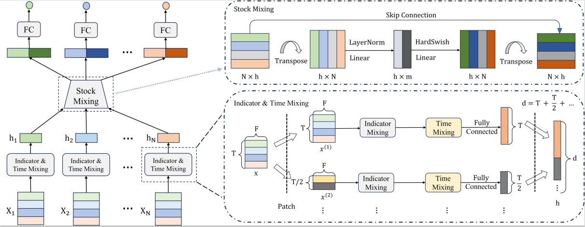

# StockMixer

Official code implementation and supplementary material of AAAI 2024 paper "**StockMixer: A Simple yet Strong MLP-based Architecture for Stock Price Forecasting**". This work proposes a lightweight and effective MLP-based architecture for stock price forecasting named StockMixer. It consists of indicator mixing, temporal mixing and stock mixing to capture complex correlations in the stock data. The end-to-end training flow of StockMixer is presented as follows:



## Environment

- Python 3.7
- torch~=1.10.1
- numpy~=1.21.5
- PyYAML, pandas, tqdm, matplotlib

## Dataset and Preprocessing

The original datasets(NASDAQ, NYSE and S&P500) are respectively available:

NASDAQ/NYSE: [Temporal Relational Ranking for Stock Prediction](https://github.com/fulifeng/Temporal_Relational_Stock_Ranking)

S&P500: [Efficient Integration of Multi-Order Dynamics and Internal Dynamics in Stock Movement Prediction](https://github.com/thanhtrunghuynh93/estimate)

In order to improve file reading speed, we process the raw data to generate corresponding .pkl or .npy files. Datasets are provided in the `dataset` folder. Because StockMixer does not require prior knowledge similar to graphs or hypergraphs, our preprocessed dataset did not provide either. You can find them from the original datasets.

## Running the Code

```
# edit configurations in train.py
python src/train.py
```

